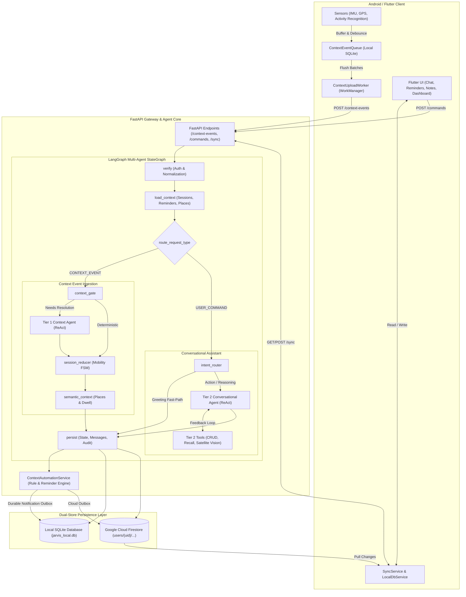

# Jarvis — Context-Aware Personal Intelligence System

[](https://www.python.org/)
[](https://fastapi.tiangolo.com/)
[](https://langchain-ai.github.io/langgraph/)
[](https://flutter.dev/)

> **Reference Specification**: [Business & Technical Requirements Document](https://docs.google.com/document/d/1bQ1C_QToxUBIIz9rGX2Db8rnn-ew36rY3wqgkh7S3xM/edit?usp=sharing)

Jarvis is a context-aware personal intelligence assistant combining:
1. **Low-power Android Edge Telemetry**: Continuous activity recognition, opportunistic location sensing, and high-frequency IMU vibration signature analysis (e.g. Royal Enfield Hunter 350 vs car detection).
2. **Deterministic Mobility Session State Machine**: Automatic detection and tracking of transitions across `IDLE`, `MOVING`, `DWELL`, `PARKING`, and `SHOP_VISIT`.
3. **Multi-Agent LangGraph Reasoning**: Dual-tier architecture featuring Tier 1 fast-context routing and Tier 2 autonomous ReAct conversational orchestration with satellite visual spatial verification.
4. **Offline-First Dual Persistence**: Local SQLite cache on both mobile and backend with resilient bidirectional sync to Google Cloud Firestore.

---

## System Architecture



---

## Repository Structure

```text
Jarvis/
├── backend/                       # Python Backend (FastAPI, LangGraph, SQLite, Firestore)
│   ├── data/                      # Local SQLite databases (jarvis_local.db)
│   ├── pyproject.toml             # Python 3.12+ project configuration (uv managed)
│   ├── scripts/                   # Operational & maintenance utilities
│   │   ├── delete_all_chats.py    # Local SQLite chat thread purge script
│   │   └── purge_chats.py         # Cloud Firestore chat session purge script
│   ├── src/
│   │   ├── api/                   # FastAPI routes, middleware, and rate limiters
│   │   │   ├── routers/           # context_events, commands, automation, sync
│   │   │   ├── main.py            # ASGI application lifecycle and entrypoint
│   │   │   └── middleware.py      # Request limiting and structured request logging
│   │   ├── backend/               # Domain context & mobility engine
│   │   │   ├── context_automation.py # Rule matching, reminder triggers, notification outbox
│   │   │   ├── semantic_context.py   # Dwell time, shop inference, place clustering
│   │   │   ├── session_manager.py    # MobilitySession state machine (IDLE/MOVING/DWELL)
│   │   │   ├── context_history.py    # Timeline formatting and lookback queries
│   │   │   └── audit_log.py          # Structured per-node audit trail
│   │   ├── cloud/                 # Agent Toolkits & LLM Reasoning
│   │   │   ├── tier1_agent_tools.py  # IMU vibration & candidate resolution tools
│   │   │   └── tier2_agent_tools.py  # CRUD tools, context recall, satellite vision
│   │   ├── graph/                 # LangGraph Multi-Agent Architecture
│   │   │   ├── builder.py         # StateGraph builder and conditional edge routing
│   │   │   ├── state.py           # Typed JarvisState definition
│   │   │   └── nodes/             # Node handlers (tier1_agent, tier2_agent, persist, etc.)
│   │   ├── models/                # Pydantic schemas and domain enums
│   │   ├── services/              # External services & persistence integrations
│   │   │   ├── database/          # SQLite service & domain repository mixins
│   │   │   ├── firestore_service.py # Google Cloud Firestore client
│   │   │   ├── places_client.py   # Google Places API integration
│   │   │   └── satellite_vision_service.py # Google Static Maps + Vision LLM
│   │   └── settings.py            # Central environment & budget configuration
│   └── tests/                     # Test suite (76+ automated unit & integration tests)
│
├── mobile/                        # Flutter Mobile Application (Android / iOS)
│   ├── android/                   # Native Android background services & receivers
│   │   └── app/src/main/kotlin/.../
│   │       ├── ActivityRecognitionRegistrar.kt # Play Services activity transition client
│   │       ├── ContextEventQueue.kt            # Native SQLite telemetry buffer
│   │       ├── ContextUploadWorker.kt          # WorkManager batch uploader
│   │       └── TelemetryForegroundService.kt   # Persistent background monitoring service
│   ├── lib/
│   │   ├── main.dart              # Flutter application bootstrap
│   │   ├── models/                # Data models (sensor_sample, recording_session, etc.)
│   │   ├── services/              # Local DB, sensor bridge, and bidirectional sync
│   │   └── ui/                    # Screens (chat, reminders, notes, dashboard) & theme
│   └── test/                      # Flutter unit & feature extraction tests
│
└── notebooks/                     # Exploratory Data Analysis & Telemetry Modeling
    ├── analyze_telemetry.py       # IMU spectral vibration analyzer
    └── telemetry_analysis_and_reasoning.ipynb # Jupyter research notebook
```

---

## Core Capabilities

### 1. Mobility Session & Semantic Context Engine
- **Deterministic Journey Tracking**: Automatically transitions through `CREATED` → `MOVING` → `PAUSED` → `COMPLETED`.
- **Intelligent Parking Anchor**: Latches the vehicle coordinate when switching from vehicle to foot, allowing the user to ask *"Where did I park my bike?"*.
- **Semantic Places & Shop Dwell**: Resolves nearby candidates using Google Places API and clusters repeated visits. Identifies dwell periods exceeding threshold (`MIN_DWELL_SEC`) and tracks shopping stops without false purchase assumptions.

### 2. Autonomous Multi-Agent Hierarchy
- **Tier 1 Context Reasoner**: Lightweight model for high-speed sensor disambiguation. When accelerometer/gyroscope signals conflict with GPS (e.g. riding a motorcycle vs passenger in a bus), Tier 1 matches vibration frequency spectra (12Hz Hunter 350 signature) to confirm vehicle mode.
- **Tier 2 Conversational & Task Orchestrator**: LangGraph ReAct agent powered by frontier models (Claude / GPT / Gemini via OpenRouter). Capable of multi-step tool reasoning:
  - Natural language reminder creation with relative time coercion (`"in 20 minutes"`) and location triggers (`"when I reach home"`).
  - Sibling auto-completion: Completing a shopping errand automatically satisfies related errand items.
  - Multi-turn conversation and context memory recall.
- **Satellite Visual Geometry Inspection**: Autonomously fetches high-resolution satellite imagery from Google Static Maps for a user's location and uses vision reasoning to describe physical layouts, walking space, complex gates, and access paths.

### 3. Edge-Resilient Context Automation & Sync
- **Local Notification Outbox**: Context rules and reminders evaluate deterministically inside the local backend. Fired reminders generate durable outbox records with transactional idempotency, preventing duplicate alerts across retries.
- **Bi-Directional Sync**: Mobile client operates 100% offline using `jarvis_mobile.db`. Background sync workers reconcile records with Google Cloud Firestore when connectivity is restored.

---

## Getting Started

### Prerequisites
- Python 3.12+ with [`uv`](https://docs.astral.sh/uv/)
- Flutter 3.24+ & Android Studio (SDK 34+)
- Google Cloud Project (for Firestore & Google Places API, optional for purely local execution)

### Backend Setup

1. **Install dependencies**:
   ```bash
   cd backend
   uv sync
   ```

2. **Configure environment**:
   ```bash
   cp .env.example .env
   # Edit .env with your OPENROUTER_API_KEY and GOOGLE_PLACES_API_KEY
   ```

3. **Run the local backend**:
   ```bash
   uv run backend
   # API will start on http://0.0.0.0:8080
   ```

4. **Execute tests**:
   ```bash
   uv run pytest -v -k "not satellite"
   ```

5. **Operational scripts**:
   ```bash
   uv run delete-chats   # Purge local SQLite chat records
   uv run purge-chats    # Purge Cloud Firestore chat records
   ```

### Mobile Setup

1. **Install Flutter packages**:
   ```bash
   cd mobile
   flutter pub get
   ```

2. **Run on Android device or emulator**:
   ```bash
   flutter run
   ```

---

## License & Attribution

Internal Development — Jarvis Context-Aware Assistant. All rights reserved.
