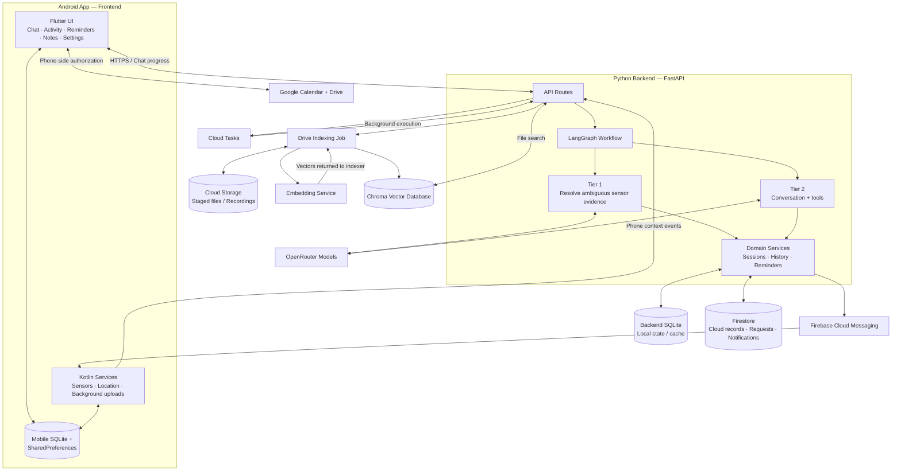

# Jarvis architecture flowchart

Saved from the architecture flowchart in this chat on 11 October 2026.

```mermaid
flowchart TD
    subgraph Phone["Android App — Frontend"]
        UI["Flutter UI<br/>Chat · Activity · Reminders · Notes · Settings"]
        Native["Kotlin Services<br/>Sensors · Location · Background uploads"]
        Local[("Mobile SQLite +<br/>SharedPreferences")]
        UI <--> Local
        Native <--> Local
    end

    UI <-->|"HTTPS / Chat progress"| API
    Native -->|"Phone context events"| API

    subgraph Backend["Python Backend — FastAPI"]
        API["API Routes"]
        Router["LangGraph Workflow"]
        T1["Tier 1<br/>Resolve ambiguous sensor evidence"]
        T2["Tier 2<br/>Conversation + tools"]
        Logic["Domain Services<br/>Sessions · History · Reminders"]
        API --> Router
        Router --> T1
        Router --> T2
        T1 --> Logic
        T2 --> Logic
    end

    Logic <--> SQL[("Backend SQLite<br/>Local state / cache")]
    Logic <--> FS[("Firestore<br/>Cloud records · Requests · Notifications")]
    T1 <--> LLM["OpenRouter Models"]
    T2 <--> LLM

    UI <-->|"Phone-side authorization"| Google["Google Calendar + Drive"]

    API --> Index["Drive Indexing Job"]
    Index <--> Storage[("Cloud Storage<br/>Staged files / Recordings")]
    Index --> Embed["Embedding Service"]
    Embed -->|"Vectors returned to indexer"| Index
    Index --> Chroma[("Chroma Vector Database")]
    API <-->|"File search"| Chroma

    Logic --> Push["Firebase Cloud Messaging"]
    Push --> Native
    API --> Tasks["Cloud Tasks"]
    Tasks -->|"Background execution"| API
```
